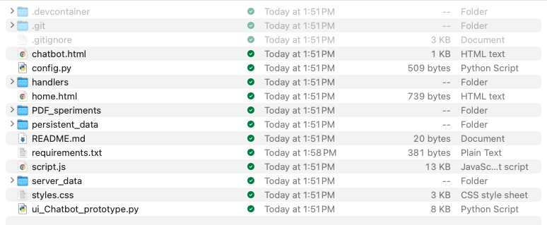

# INSPORT-refactor
Don Rosenthal  
February 2025

## Background

The Chatbot POC was originally to test the AI capabilities desired for the original Insurance Portal website. That version of the chatbot was conceived as a component of a larger application.

In addition to functions performed by the main application which are not connected to the browser-based Chatbot it relied on a main application for such standard functions as user login and authentication, long term storage of user data (name, profile, etc.), and the uploading and storage of user's insurance policies. Most importantly, the main application, not the bot, was tasked with converting those policies from .pdf file to a text-based version that was usable by the LLM.

The chatbot controls user interactions with the LLM, the UI, and the maintenance of session state of the chat through as many focus changes to and from the chatbot as the user initiates. When the chatbot needs user data or the contents of any of their files, it will GET that data through API calls, but will not store any of the retrieved data. The chatbot can also PUT or change some of the user data through API calls.

The main functionality of the bot to be incorporated and tested by this POV were the AI-based functions: developing the system prompts, the creation of the queries from system prompts, optional policy contents, option, policy contents instructions, and user queries, and the streaming of the responses from the LLM.

In addition, a fully functional, but not "designer pretty" UI was generated to connect UI events to event handlers for such things as initialization, user policy selection, user query input, focus change, etc. A minimal landing page was also included to enable the tester to simulate switching back and forth between the bot and the main app to test state management through focus changes.

## Disclaimers

I have not coded commercially for a long time, and have never built front-ends, so my work was mostly focused on the AI components, and the POV was never intended to include a full client-server implementation. That architecture was simulated by carefully separating out functionality into different subdirectories, and enabling access to that code by including those files as libraries. There are no actual APIs or API calls.

In addition, as there was no actual main application for the POC version of the chatbot, it needed to include some basic functionality that the main app would be supplying, such as .pdf conversion. The deployed system will need to utilize some more capable converters, that, e.g., include OCR, as the POC utilized pdfminer, which is quite limited.

The LLM that was originally chosen for the Chatbot was OpenAI's GPT-based family. This was changed to Gemini when the decision was made to try to partner with Google. The conversion was made before Gemini's API included OpenAI compatibility, requiring code changes to implement direct access to the Gemini APIs. The original GPT-based system prompts, chains, etc., are retained in the code, in commented-out sections.

## Directory Tree

The code was divided up into separate files and directories based on function, e.g.,
- **root**
  - home.html (the "landing page")
  - chatbot.html (the chatbot page)
  - script.js (for the chatbot)
  - styles.css (for the chatbot)
  - ui_Chatbot_prototype.py (the Python "main")
- **handlers (subdirectory)**
  - Ui_handler_functions.py (the logic required to handle UI events)
- **persistent_data (subdirectory)**
  - ui_session_data_mgmt.py (session state data management)
- **server_data (subdirectory)**
  - ui_server_side_data.py (mocked up server-side data)
    - Note that this data, including directory paths to files, is hard-coded, and the directory paths will need to be adjusted when the repo is cloned.
- **PDF_speriments**
  - Directory where the test policy .pdf files and their converted versions are stored
- **.devcontainer (subdirectory)**
  - devcontainer.json (defines the Docker container and initializes the Python environment)

## Current Status

All of the required functionality for the version of the chatbot described above is fully tested and running to spec, (and is fully documented in a series of SOWs).

Cloning the repo is discussed below in [Cloning the Repo and Running the Code](#cloning-the-repo-and-running-the-code).

After the completion of that work, significant additional requirements were requested, based on a change to focussing on Consumer Advocacy. These are **additional** requirements, and do not affect the initial requirements. Work has begun on the new requirements, but due to my absence on medical leave, none of those requirements have been fully implemented yet. They are discussed below in the [New Work](#new-work) section below.

## Cloning the Repo and Running the Code

### Cloning the Repo

The repo can be found at [https://github.com/donrosenthal/INSPORT-refactor.git](https://github.com/donrosenthal/INSPORT-refactor.git)

1. Open your CLI and navigate to the directory where you want to clone the repo
2. In your terminal, type, "git clone https://github.com/donrosenthal/INSPORT-refactor.git"
3. It should create the directory "INSPORT-refactor" with this top-level directory:

4. The file "requirements.txt" contains the requirements needed to build the python environment, including for Gemini and OpenAI (currently commented out).
   - The requirements.txt file is handled by devcontainer.json in the .devcontainer subdiretcory

### API Keys

Create a .env file in the root directory of the cloned repo. Include the following:

- For Gemini include an API key from a metered account. (Rate limits of a Free Tier account are extremely low.)
  - `GOOGLE_API_KEY="Your_Gemini_API_Key"`
- For OpenAI:
  - `OPENAI_API_KEY="Your_OpenAI_API_Key"`
- A Langchain API key:
  - `LANGCHAIN_API_KEY="Your_Langchain_API_Key"`

### Running the Code

The code is built to run from VSCode, but as it is containerized it should run from anywhere you can create the docker container.

In VSCode:
1. In the terminal, navigate to the root directory of the cloned repo.
2. Use Command (⌘) + Shift + P to open the Command Pallette, and select, "Dev Containers: Rebuild Container Without Cache"
3. When done, press any key to close the terminal.
4. Reopen the terminal in the root directory
5. Launch the demo with: `python ui_Chatbot_prototype.py --user <user-choice>`, where user choice can be either "user0" or "user2".
   - (`python ui_C* ---user <user-choice>` works as well, of course.)
   - Choosing user0 will open the demo with a user who has not uploaded any policies
   - Choosing user2 will upload the demo with a user who has uploaded 2 policies
     - Although only Lincoln Life 2 is functional
6. A popup will appear to allow you to Open the demo in a Browser from port 8000
   - Click "Open in Browser"
7. This will display the "Landing Page"
8. Click "Click here to switch to the Chatbot
9. This will take you to the Chatbot Page
10. Here you can ask any questions about insurance (e.g., What is the difference between term and permanent Life Insurance?)
11. And if you have chosen user2, you can select Lincoln Life 2 (Term) from the radio buttons, and also ask questions about that policy (e.g. What is the premium schedule for this policy? Are there any "gotchas" in this policy that I should be aware of?)

## New Work

Note that the requirements have also been changed and added to, but those have not yet been formally gathered and documented.

The new work is spelled out in the Google Doc [Prioritization of New Insurance Portal Chatbot Features](https://docs.google.com/document/d/your-doc-id), and includes the following sections:

1. [Generate the SOW](#)
2. [Chatbot PRD](#)
3. [Accommodate All Insurance Types](#)
4. [Referral to an Insurance Professional](#)
5. [Caching of reused text](#)
6. [Gemini-based PDF Converter](#)
7. [Consumer Advocacy](#)
8. [Actual Client/Server Architecture](#)
9. [Put all hardcoded values into a separate YAML configuration file](#)

Section 5. Above itself refers to an additional document: [Using Cached Context with the Insurance Portal Chatbot](#) which goes into much more detail about the specific constraints of caching both the insurance policy contents as well as the texts from the system prompt, the policy prompt addition, etc.
